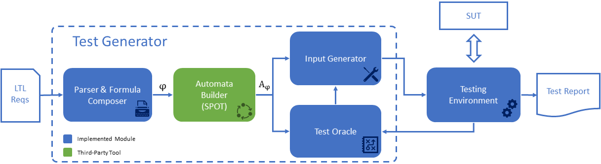
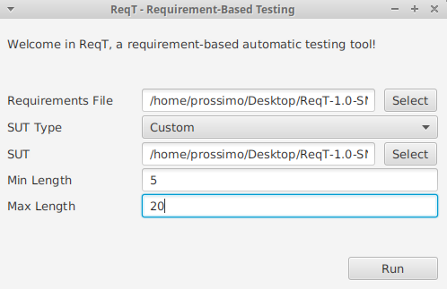
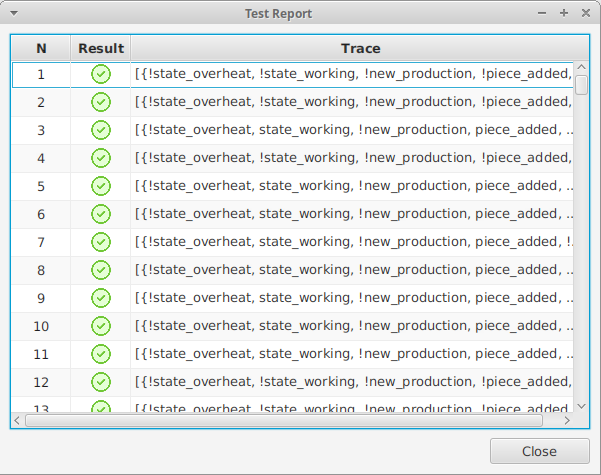
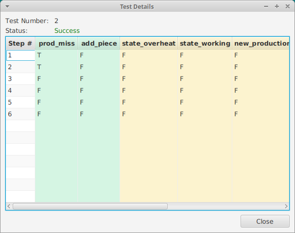

# Tutorial

This tutorial shows how ReqT works and how to test a custom system.

## Testing Framework

In order to test black-box systems, ReqT adopts the framework presented below.
The System Under Test (SUT) is the system we want to test, and ReqT interact with it during execution, probing some 
inputs and evaluating the produced output.

The tests are generated starting from a formal specification.
In particular, we assume that
the specification is composed of a list of LTL formulas or PSPs requirements, plus the declaration 
of the set input and output properties.
To write and verify the correctness of requirements you can use [ReqV](https://gitlab.sagelab.it/sage/ReqV).

The main components of the framework are:

- **Parser** reads the input specification, creates the intermediate data structures
and builds the conjunction of requirements.
- **Automata Builder** builds a Büchi or equivalent automaton representation of
the input specification.
- **Input Generator** chooses which inputs to execute on the SUT.
- **Test Oracle** evaluates the output produced by the SUT and checks if it satisfies the specifications.
- **Testing Environment** is responsible for orchestrating the interaction between the
different components. It queries Input Generator for new tests and executes them
on the SUT. It collects the output and passes it to Oracle for evaluation. If the
test is complete, it stores the final verdict and resets the environment to start a
new test.

## System Under Test

ReqT have to communicate with the System Under Test (SUT) in order to collect outputs and evaluate the tests status.

To make this communication happen, we have to define a Java class that extend the **SUT** class (defined in 
the [SpecPro](https://gitlab.sagelab.it/sage/SpecPro) library)

    import it.sagelab.specpro.models.ltl.Atom;
    import it.sagelab.specpro.models.ltl.assign.Assignment;
    import it.sagelab.specpro.testing.SUT;
    
    public class CustomSUT extends SUT {
    
and implements its abstract methods:
 
 - **Reset:** called whenever the SUT should be resetted to its initial state
 
    
       @Override
       public void reset() {
       }
    
    
 - **Exec:** it takes the input assignment to execute on the SUT and returns a new assignment with the output
 of the system

       @Override
       public Assignment exec(Assignment input) {
           boolean inputVar = input.getAssignments().get("inputVar");
           ...
           Assignment output = new Assignment();
           output.add(new Atom("outputVar"), false);
           return output;
       }
     
This is it, with these two methods ReqT can interact with SUT and automatically execute the generated tests.

## Example

Now that we know how ReqT works, let's see it in action with an example. 

1) First of all, let's download the latest version of ReqT from [here](../dist), decompress and start it:

    $ ./bin/ReqT
    
2) Click the **Select** button on the right of *Requirements File* field and select the file *examples/CustomModel/prodMachine.req*

3) Select *Custom* from the *SUT Type* dropdown menu

4) Click the **Select** button on the right of *SUT* field and select the file *examples/CustomModel/CustomSUT.java*.

5) Leave *Min Length* and *Max Length* to their default values (5 and 20)

6) Press the **Run** button to start the testing on the SUT.

7) After a few moments a new window with the testing report should appear

8) Double clicking on a test we can observe the datails of the selected test. In each row of the table 
is shown a step of the execution, with the value assigned to the variables (inputs on the left, in green, and outputs on the right, in yellow).

    
